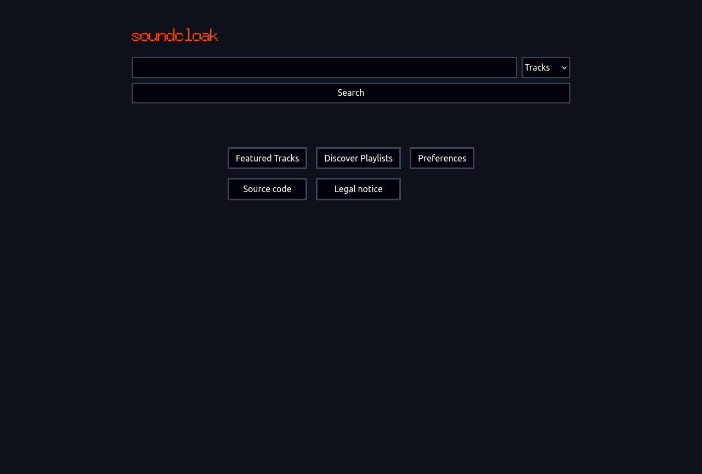
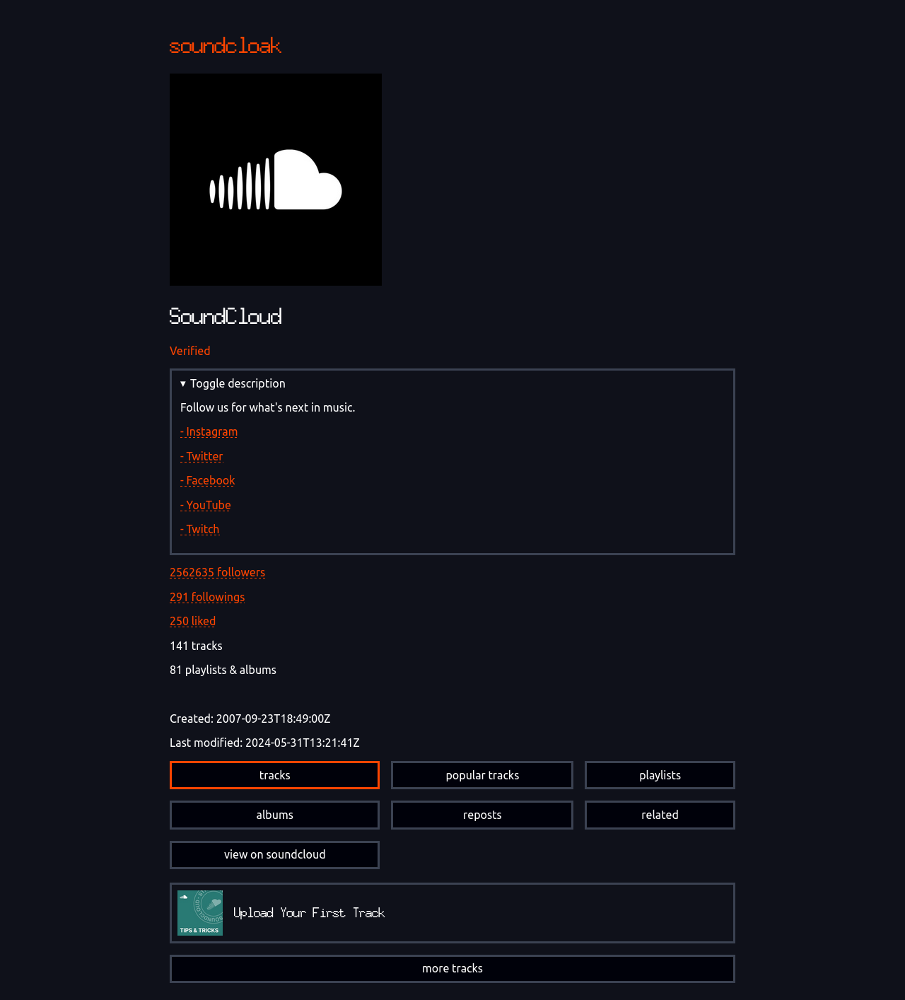
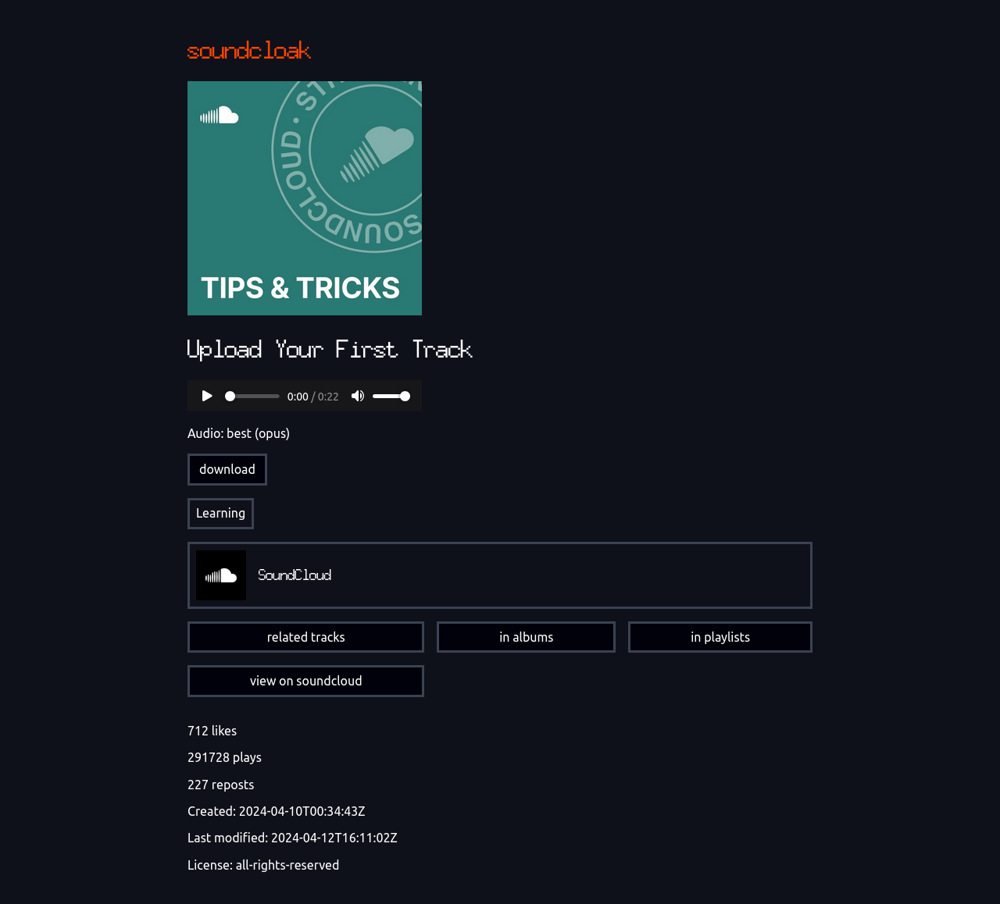

# soundcloak
Frontend for SoundCloud

# About
- Designed to preserve your privacy. All requests to SoundCloud API are done server-side, without logging into an account. Media (tracks, images) can also be proxied if enabled by instance maintainer. No unnecessary requests or telemetry tracking your every move
- Lightweight and performant. Both server-side and client-side. Not far behind the official webapp, even faster in some cases
- Works without JavaScript (for most of the functionality)
- Pretty configurable. Both for instance maintainers, and for regular users
- URL scheme similar to SoundCloud's in most places
- It's also possible to download tracks, together with metadata

# Screenshots

Click to view

# Documentation
## [User Guide](docs/USER_GUIDE.md)
## [Instance Maintainer Guide](docs/INSTANCE_GUIDE.md)
## [Development Guide](docs/DEV_GUIDE.md)

If you have any questions, or just wanna talk about soundcloak, you can join the maid.zone XMPP/Matrix chat: [public@muc.maid.zone](xmpp:public@muc.maid.zone?join) / [#maidzone:laincorp.tech](https://matrix.to/#/#maidzone:laincorp.tech)

# Notice
soundcloak is not affiliated with SoundCloud.